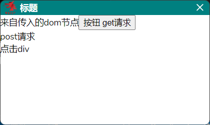

# README

## About

This is the official Wails React-TS template.

You can configure the project by editing `wails.json`. More information about the project settings can be found
here: https://wails.io/docs/reference/project-config

## Live Development

To run in live development mode, run `wails dev` in the project directory. This will run a Vite development
server that will provide very fast hot reload of your frontend changes. If you want to develop in a browser
and have access to your Go methods, there is also a dev server that runs on http://localhost:34115. Connect
to this in your browser, and you can call your Go code from devtools.

## Building

To build a redistributable, production mode package, use `wails build`.


## 项目说明

这是一个使用wails和react-ts创建的桌面应用程序。



## 运行
本地开发
`set ENV_VAR=dev`
`wails dev`
wails doctor 检查您是否安装了正确的依赖项

## 打包
在项目目录下运行`wails build -clean`来构建可发布的应用程序。
`wails build -clean`
`wails build -clean -devtools -debug -platform windows/arm64`


## 项目配置

项目配置文件是`wails.json`。你可以通过编辑这个文件来配置你的项目。
## 项目结构

项目结构如下：

```
├── README.md
├── frontend  前端代码
│   ├── index.html
│   ├── index.tsx
│   ├── main.css
│   └── main.tsx
├── wailsjs golang 编译代码
├── golang golang代码
│   ├── go
│   │   └── main.go

```

## 使用
desktop-notice.exe --title="标题" --html="<div style="color:red;">我是div<div>" --showClose=0

desktop-notice.exe --title="标题" --text="放假" --type="text" --icon="default" --textAlign="center"

desktop-notice.exe --title="标题" --text="放假" --type="text" --width=536 --height=400 --autoCloseWindowTimer=-1

desktop-notice.exe --title="标题" --autoCloseWindowTimer=-1 --html="<div>来自传入的dom节点<button onclick="window.DesktopNotice.request(http://localhost:3000)">按钮 get请求</button><div onClick="window.DesktopNotice.request(http://localhost:3000/postTest,{method:'post',data:{name:'工具人'},finallyClose:true})">post请求</div><div onClick="window.DesktopNotice.myGlobalFunction()">点击div</div></div>"

desktop-notice.exe --title="标题" --html="E:\ZHIXIN\automation_auto\DesktopNotice\test\index.html" --autoCloseWindowTimer=-1

desktop-notice.exe --title="标题" --text="[{\"type\":\"text\",\"text\":\"最新通知，链接如下：最新通知，链接如下：最新通知，链接如下：\"},{\"type\":\"row\",\"text\":\"\"},{\"type\":\"link\",\"text\":\"www.baidu.com\"},{\"type\":\"row\",\"text\":\"\"},{\"type\":\"img\",\"text\":\"https://cdn.wwads.cn/creatives/m88Dv8ffgDW2NO9TVOfe2Ee3QYRtwORH2acMe3Id.png\",\"style\":{\"width\":\"120px\",\"height\":\"120px\"}}]" --icon="default" --textAlign="start"

html 参数可传
const html = `<div>我是div<button id="button" onclick="window.DesktopNotice.request(http://localhost:3000,{ data: { name: 1 } })">按钮</button><div onClick="window.DesktopNotice.request(http://localhost:3000/postTest,{method: 'post',data: {name: '工具人' }} )">post请求</div><div onClick="window.DesktopNotice.myGlobalFunction()">点击div</div></div>`
const html = `E:\ZHIXIN\automation_auto\DesktopNotice\test\index.html`

## 参数说明
```
--title 通知标题
--html html
--text 通知内容，对应type显示， 支持json字符串，支持style等标签支持的其他扩展属性， type 扩展 row 属性代表换行。 检测到已json时优先显示，type字段无效！！！
--type 通知类型，支持text,link,img 
--icon 通知图标，支持default
--textAlign 通知内容对齐方式，支持textAlign 属性 start,center,end ...
--width 宽 默认336
--height 高 默认200
--autoCloseWindowTimer 自动关闭窗口的时间默认5000， 设置为-1 不自动关闭
--showClose 是否显示关闭按钮 默认 1 显示  0 不显示

```

## window 挂载方法
    window.DesktopNotice.request(url, options) 发起请求 options:{finallyClose:true} 请求完成后会关闭窗口
    window.DesktopNotice.closeWindow() 关闭窗口